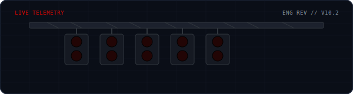
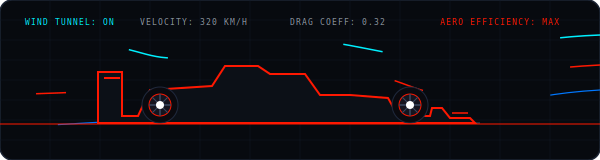

<!-- F1 STARTING LIGHTS GANTRY ANIMATION -->

# 🏎️ DIVYANSHU SHARMA (DEVCOOL20) 🏁

<!-- DYNAMIC TYPING TELEMETRY -->

  
  
  

  
  &nbsp;&nbsp;
  

---

### 🚦 PIT WALL TELEMETRY [LIVE]

> [!NOTE]
> **"Box box box! Deploying new v2.0 engine to production. Tires: Soft (Experimental). Strategy: Purple sectors only."** — *A passionate Mobile and Web Application Developer.*

- 🔭 I’m currently working on **[LoQL](https://github.com/devcool20/loql-web)** and **[projectf1](https://github.com/devcool20/projf1)**
- 🌱 I’m currently learning **Machine Learning and Backend**
- 💬 Ask me about **Typescript and Python**
- 📫 How to reach me **[sharmadivyanshu265@gmail.com](mailto:sharmadivyanshu265@gmail.com)**
- ⚡ Fun fact **I might make you laugh!**

---

### 💨 AERODYNAMICS & WIND TUNNEL SIMULATION [CFD]

  

---

### 🛠️ TECH TELEMETRY

<table width="100%">
  <tr>
    <!-- ENGINE -->
    <td valign="top" width="50%">
      <h4>⚙️ ENGINE (Languages)</h4>
      
      
      
      
       
      <h4>🏎️ CHASSIS (Frontend)</h4>
      
      
      
      
    </td>
    <!-- FUEL -->
    <td valign="top" width="50%">
      <h4>⛽ FUEL (Backend & Data)</h4>
      
      
      
      
       
      <h4>🔧 GEARBOX (Tools)</h4>
      
      
      
    </td>
  </tr>
</table>

---

### 📊 PERFORMANCE METRICS (Telemetry)

  <table border="0" cellpadding="0" cellspacing="0" width="100%">
    <tr>
      <td width="50%" align="center">
        
      </td>
      <td width="50%" align="center">
        
      </td>
    </tr>
  </table>

---

### 🏆 CONSTRUCTORS' CHAMPIONSHIP STANDINGS

| Pos | Constructor (Project) | Power Unit (Tech Stack) | Telemetry (Description) | Status |
| :---: | :--- | :--- | :--- | :---: |
| 🥇 **01** | [loql-web](https://github.com/devcool20/loql-web) | `TypeScript` // `React` // `Tailwind` | Advanced Web interface for LoQL local database. | 🟢 **In Development** |
| 🥈 **02** | [projf1](https://github.com/devcool20/projf1) | `TypeScript` // `NextJS` // `API` | Project F1: High-performance telemetry analytics. | 🟢 **In Development** |
| 🥉 **03** | [sales-doc](https://github.com/devcool20/sales-doc) | `TypeScript` // `NextJS` // `AI` | **SalesDoc AI**: Sales analytics & enablement platform using hybrid AI. | 🟡 **Stable** |
| **04** | [proof-estate](https://github.com/devcool20/proof-estate) | `TypeScript` // `React` // `Web3` | Premium real estate proofing and management platform. | 🟡 **Stable** |
| **05** | [portfolio-divyanshu](https://github.com/devcool20/portfolio-divyanshu) | `TypeScript` // `NextJS` // `CSS` | Personal space & portfolio displaying engineering track record. | 🟢 **Active** |
| **06** | [rentok](https://github.com/devcool20/rentok) | `TypeScript` // `Node.js` // `Database` | Rentok rental management engine. | 🟡 **Stable** |

### 🏁 CHAMPIONSHIP PROJECTS (Recent Laps)
* **[P1] NextJS-Telemetry-Core** - High-performance dashboard for monitoring real-time racing data streams.
* **[P2] Pitstop-Automator** - CI/CD pipeline optimizer with sub-2s deployment visualizer.
* **[P3] Aero-Grid-System** - A lightweight CSS framework optimized for wind-tunnel-like data visualization.

---

### 🏁 PIT STOP (Connect with me)

&nbsp;&nbsp;&nbsp;&nbsp;

&nbsp;&nbsp;&nbsp;&nbsp;

&nbsp;&nbsp;&nbsp;&nbsp;

&nbsp;&nbsp;&nbsp;&nbsp;

---

  <i>LATENCY: 14MS // BUILD: v8.4.2-STABLE // SYSTEM: NOMINAL</i> 
   
  

